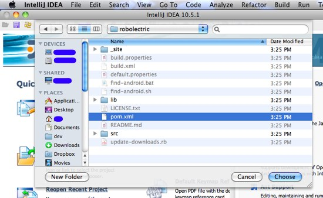

# Quick Start for IntelliJ
Thanks JetBrains! As of IntelliJ 10.5 makes developing Android applications with Robolectric easy.

### Maven
This is by far the easiest installation method.

1. Open IntelliJ
2. Select File &rarr; Open Project... &rarr; select the `pom.xml`.

### Git Submodules
[Android IntelliJ Starter](https://github.com/pivotal/AndroidIntelliJStarter) is a "template" which configures Robolectric as a [git submodule](http://kernel.org/pub/software/scm/git/docs/git-submodule.html "git-submodule(1)"). This is especially useful if you plan on forking Robolectric.

------

## Manual Creation
Use this section for reference if you have issues, or if you need create a project completely from scratch.

###Project Creation
Create a project
- File &rarr; New Project
- Name: MyProject
- Select Type:  "Android Module"
- Next

Fill in the source directory
- "Create source directory" (radio):
- Enter: src/main/java
- Next

Select the SDK
_ (You may need to run the Android tool to download/install an sdk version. Robolectric REQUIRES a Google Apis version of the sdk.)_
- SDK properties: Android X.X Google APIs
- Finish

###Prepare directory structures
At the command line:

    mkdir -p .../MyProject/src/libs/test
    mkdir -p .../MyProject/src/libs/main    #production jars go here e.g. roboguice
    mkdir -p .../MyProject/src/test/java
    mkdir -p .../MyProject/src/gen

###Install downloaded jars

    cp robolectric-X.X.X-jar-with-dependencies.jar .../MyProject/src/libs/test
    cp junit-4.x.x.jar .../MyProject/src/libs/test

###Configure the IntelliJ project

Open the Modules tab of Project Settings
- In File &rarr; Project Structure...
- Project Settings &rarr; Select "Modules"

Create a new module
- Press the "+" in the tool bar at the top of the dialog to create a new module
- "Create module from scratch" radio &rarr; Next

> Name: src 
> Content root: .../MyProject/src 	# default value 
> Module file location: .../MyProject/src  	# default value 
> Type: java  	# default selection 
> Next

- Accept .../MyProject/src/main/java \[java\] as a source root
- Next 

No additional facets/technologies required

- Finish

###Configure generated source directories
-------------------------
In the Modules tab of Project Settings
- Select "Modules"
- Expand the MyProject module's node
- select "Android" facet
- select "compiler"
- Under AAPT Complier - Destination Directory enter: <code>.../MyProject/src/gen</code>
- Under AIDL Compiler - Destination Directory enter: <code>.../MyProject/src/gen</code>

###Remove unused source directories from the main project
------------------------------
_(you may have to do this several times since IntelliJ
automatically replaces this setting from time to time)_
- Select the MyProject module "Sources" tab
- Delete the "gen" source folder by clicking the "x" at the end of its line
- Delete the "src/gen" source folder by clicking the "x" at the end of its line

###Set up source directories for the "src" module
-------------------------------
- Select the "src" module &rarr; "Sources" tab
- In the source tree out on the far right, select the <code>.../MyProject/src/test/java</code>
folder and click the green "Test Sources" button above the source tree, adding it as a test source folder
- Select the <code>.../MyProject/src/gen</code> folder and click the blue "Sources" button, adding it as a source folder
- Click "Apply"

NOTE: you may get an error dialog here reading: 
"Cannot save settings   Module 'MyProject' must not contain source root .../MyProject/src/main/java.  The root already
belongs to module 'src'" 
To fix this problem follow the steps under "Removed unused source directories from the main project" above.

###Set up dependencies for the "src" module
-------------------------------
- Select the "src" module &rarr; "Dependencies" tab

Add the Robolectric jar
- "Add..." &rarr; "Single Entry Module Library"
- Select .../MyProject/src/libs/test/robolectric-X.X.X-jar-with-dependencies.jar
- Click "Ok"
- Click on "Compile" at the end of the newly-created dependency line, and choose "Test" from the resulting list

Add the JUnit jar
-"Add..." &rarr; "Single Entry Module Library"
- Select .../MyProject/src/libs/test/junit-4.x.x.jar
- Click "Ok"
- Click on "Compile" at the end of the newly-created dependency line, and choose "Test" from the resulting list

Add the Android libraries
- "Add..." &rarr; "Library"
- Select "Android X.X Google Apis"  # must be GOOGLE android apis and not just plain android apis

NOTE: Android X.X Google Apis MUST be moved below the junit and robolectric jar.
- Move the Android jar down so it is last in the list.
- Click "Apply"

###Set up dependencies for the main Android Project module
----------------------------
Select "MyProject" module &rarr; "Dependencies tab"

Add the "src" module
- Click "Add..." &rarr; "Module Dependency..."
- Select "src"
- Click "OK"
- Move the newly created dependency "src" row above the Android line by clicking the "Move Up" button
- Check the "src" row's export box
- Leave the src module scope at the default of "scope" &rarr; "compile"
- Click	"Apply"

###Set up exclusions for the main Android Project module
--------------------------------------------------------
- Select "MyProject" module &rarr; "Sources tab"
- In the source tree out on the far right, select the "bin" folder and click the 'Excluded' button above, adding it as an excluded folder
- Click "OK"

### Verify your setup
--------------------------------------------------------------------------------------------
In Project View, right click on MyProject>src>test>java &rarr; New &rarr; Java class &rarr;  MyActivityTest
Add the following source:


import com.example.MyActivity;
import com.example.R;
import com.xtremelabs.robolectric.RobolectricTestRunner;
import org.junit.Test;
import org.junit.runner.RunWith;

import static org.hamcrest.CoreMatchers.equalTo;
import static org.junit.Assert.assertThat;

@RunWith(RobolectricTestRunner.class)
public class MyActivityTest {

    @Test
    public void shouldHaveHappySmiles() throws Exception {
        String appName = new MyActivity().getResources().getString(R.string.app_name);
        assertThat(appName, equalTo("MyActivity"));
    }
}



- Cntl-Shift-f10 will run the test
